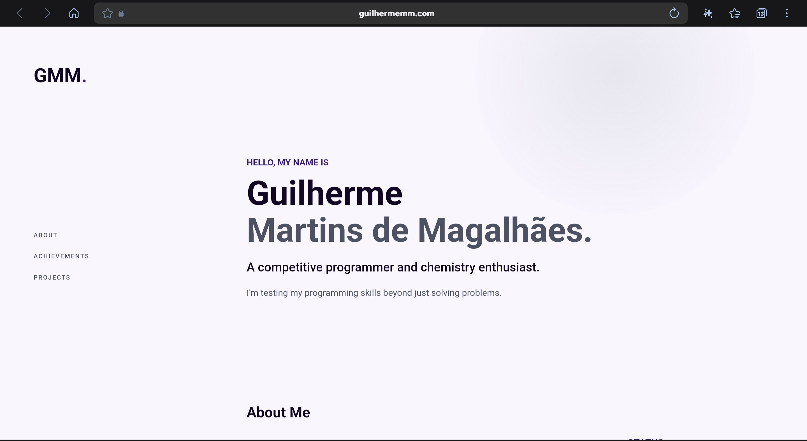

# My portfolio
## Guilherme Martins de Magalhães (GMM)

HTML · CSS · JavaScript · Design

This website was originally made to stardance hack club, but now is, to me, way more to me than just that.

I got into technology through math olympiads, which eventually led me to competitive programming and, later, chemistry. I enjoy understanding how things work, solving problems, and building small projects to experiment with new ideas.

What I do
- Competitive programming with C++
- Studying Chemistry
- Interested in UI and product design
- Learning Japanese

This website was built entiraly on VS Code dev and GitHub web.

Find me
Website: guilhermemm.com
GitHub: @GuilhermeMartins-GMM
Instagram: @gui_mm
